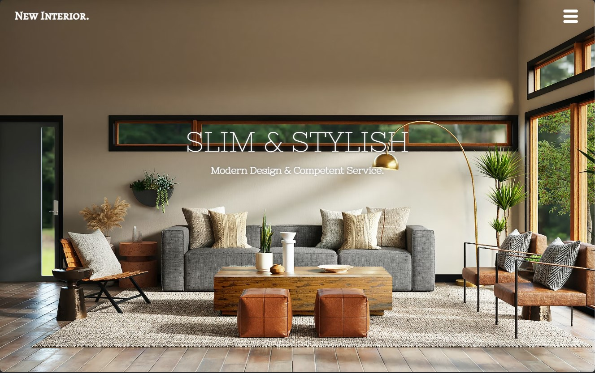
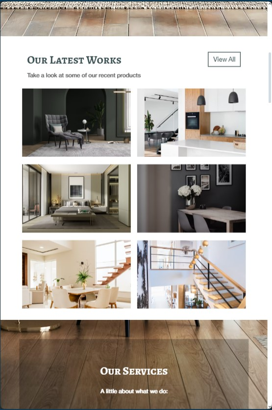
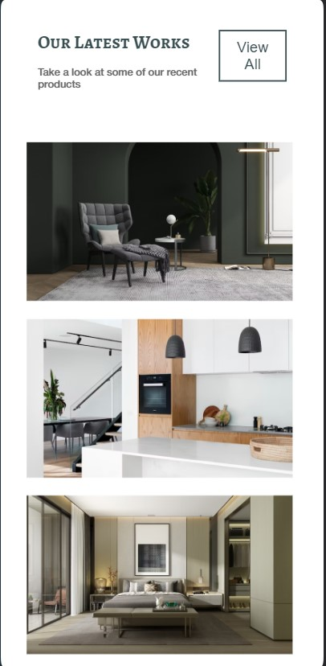
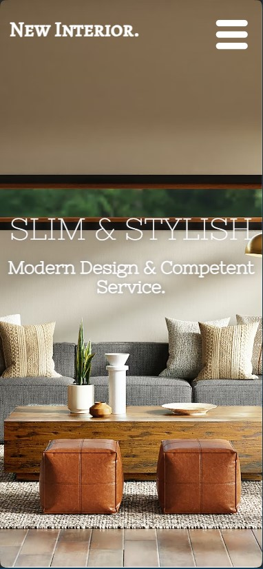

# Project "New Interior" 🪑

  

 

## Inhaltsverzeichnes
- [Worum Gehts?] <!-- (#Worum-Gehts?) -->
- [Womit und Wie habe ich gearbeitet?]
    - [Programm und Sprachen]
    - [HTML Aufbau]
    - [Meine Wahl im CSS]
- [Erklärung meines Abweichens von der Vorlage]
- [How to Run?]
- [Wobei gab es Schwierigkeiten?]

## Worum Gehts?

## Womit und Wie habe ich gearbeitet?
### Programms und Sprachen
**Markup:**  
 
 

**Styling:**  

 

**IDE:**  
  
 

**Version Control:**  
  
 

**Design:**  

[link zur Figma-Vorlage:](https://www.figma.com/design/MPdohVt4vXayZ3hI6QEIEV/css_vertiefung_projects_level_3_7-(Copy)?node-id=0-1&t=otjKWbbmrTYyjcn8-0)

### HTML Aufbau
Hier ist eine Stichpuntartige Erklärung zu meinem HTML Aufbau:
1. Ich habe den Header ausgelassen, da sich die "Navigation" (in dem Falle dieser Website auch nur Dargestellt und nicht Funktionsfähig) in der erste section, der Hero-section befindet.
2. Sections haben alle eine Id, diese Id Namen sind später auch die Unterteilung für die CSS. Falls ich es noch geschafft hätte meine idee einer ausklappbaren Navigation zu erstellen, hätte ich die IDs zu eine scroll-Navigation Verwendet und alles verlinkt
3. fürs vereinfachte Styling habe ich Clases erstellt, die sich darauf beziehen in den Kategorien:
    -  Flex: Hier gibt es drei Classes 1. flex_row 2.flex_column und 3. flex_space_between. diese habe ich den einzelnen Divs zugeteilt und kannte sie damit schnell Stylen.
    - Buttons: Hier gibs ein mal den btn_white und den btn_gray um die beiden Buttenarten schnell Stylen zu können und auch allen einen einheitlichen hover effekt zu geben
    - Schriften: hier hat die H2 noch mal eine weiße Class bekommen. das P-tag lies sich auch ohnew class in den sections ansprechen, die h2 leider nicht, somit gab es hier noch eine extra class. zudem habe ich auch 2 IDs vergeben (da sie beide nur im hero vorkommen) für den Titel und den Claim, um ihnen die Spezielle Font zu geben, die nirgendwo anders auftaucht (das bemengelt der Designer-Monk in mir schon die ganze Zeit, das ist eigentlich nicht der Way-to-go beim Design, da es eine schnelle Wiedererkennbarkeit vermindert. Ich weiß, das sollte mich bei der Umsetztung eigentlich nicht Interresieren, aber ich kann  mir das einfach nicht verkneifen). 
    - Parallax und Transparenz: Für die 3. 5. und 7. Section habe ich die classes Paralax verteilt, um nur jeweils die Background-images einfügen zu müssen und nicht jeder diese Sections diesen effekt zu geben, genauso auch bei den Semitransparenten divs, diese haben die class transparent erhalten.  
### Meine Wahl im CSS
Ich habe mich für das klassische  CSS entschieden, da ich mich damit bisher am sichersten fühle, mich sehr drüber freue, dass ich nun (nach einem Monat Code-learning) flüssig arbeiten kann, ohne durchgängig die Codes nachzuschlagen. SCSS hatte ich auch in den betracht gezogen, aber da ich gerne an meinem Windows-Rechner arbeiten wollte und wir die Installation nur auf dem Mac hatten, wollte ich zu dem Anschlussprojekt von Module 1 keine Experimente Wagen, die mir nachher den Kopf kosten könnten.

**Aufbau**
Der Aubau startet mit den eingebetteten Fonts und den Allgemeinen Styles für die ganze Website. Hier gits die Kategorien der Schriften-Styles,  und der sich wiederfindenden classes, zusammengefasst in Parallax, Buttons und Flex-box. Danach folgen die Seperaten section und am ende der Footer. die einzelenen bereiche habe ich mit kommentierten Überschriften gekennzeichnet.

Flex-Box habe ich sehr viel verwendet. Daduruch, dass wir am Montag dieser Woche erst eine Projektarbeit zu dem Thema Flex-Box hatten und das heutige Projekt direkt im Anschluss folgte (Dienstag-Mittwoch), war ich noch sehr darin, alle objekte in Flex zu denken. Zudem war es mit dem flex-warp auch super easy und schnell die passenden Media-Querys zu erstellen.

## Erklärung meines Abweichens von der Figma-Vorlage
Wie oben schon angedeutet, fand ich das Layout ion Figma in manchen Details nicht ganz optimal. hier ein mal erklärt, was ich warum gewisse anpassungen gebeben habe:
Es beginnt mit dem Titel und Claim im Hero. Hier habe wir eine sehr zarte Schrift in einer hellen Farbe, plaziert auf der hellsten stelle des Hintergrundbildes. Das sorgt für eine schlechte Lesbarkeit. um diese zu verbessen habe ich der Schrift einen umlaufenden Schlagschatten gegeben, ohne abstände damit erm mittig liegt und breit auslaufend, damit er beim ersten Blick nicht auffällt, aber die Schrift doch besser abhebt.

Weitere Allgemeine Änderung ist bei den Paralax bereichen der semi-transparente, schwarze Hintergrund. Hier finde ich dass die Figmadatei nicht berücksichtig wurde, das die Abstände teilweise unvorteilhaft na sind und mehr wie ein Fehler als wie ein gewünschter hintergrund aussehen. Ganz zufrieden bin ich mit meiner Lösung auch nicht, da müsste man nich mal ein bisschen fine-tuning betreiben

bei den Media Queries habe ich beim Tablet die Gallerie vom Blog in zwei Spalten angeordnet, nicht in drei wie in der Vorlage. In der Figma-Vorlage war es  wie bei der Desktop-Ansicht und dadurch auf dem Tablt sehr klein dargestellt. Zudem nam die Section der Gallerie dadurch wenig fläche vom Bildschirm einnamen. Man sah immer viel von den beiden umliegenden Sections, die mit ihren großen Bilder den Blick sehr fangen. Es ist einfach unvorteilhaft für diese Blog-Gallery, sie kann gar nicht auf den betrachter Wirken. Deswegen habe ich es umgestaltet. 

  

 

Beim meiner Moblie-Variante habe ich ein paar Schriftgrößen nicht wie in der Vorlage umgesetzt. Gerade bei den Titeln der sections mit den Buttons auf der rechten Seite war es in der Vorlage an manchen stellen sehr gedrungen. Hier sind die Schriften nun kleiner und der Butten kann seine Schrift umbrechen, wenn andere Objekte zu nahe kommen, um sich selb den Platz zu verschaffen, den er braucht um Richtig zu wirken

  

 

  

 

## How to Run?
- **Demo:** [Demo-Website: Project-New-Interior](https://anne-sophienehls.github.io/Project_New_Interior_2024-07-16_17/?#hero)
Hier ist ein Mal die Demo meiner Website, um sich diese im Browser anzeigen zu lassen. Um die Codes aber für sich selbst zu bekommen, solle die Repository geklont oder heruntergeladen werden:
Hierzu drückst di bei meiner GitHub-Reposety auf den grünen Button oben rechts mit dem Inhalt:<>code
hier kannst du entwerder:
        - die Zip runterladen, auf denen Computer spiecher und es in VS code öffnen
        - oder mit dem link die die Repo Clonen
zum Clonen öffne dein Terminal, und sage dem System, in welchen Ordner die Repo gecloned werden soll. 

Nach dem Clonen/Download öffnest du die HTML in VS-Code
Nun siehst du entwerder links unten ein Symbol mit dem Text "Go Live" oder du gehsr mit dem Rechtsklick auf die html und kannst hier anwählen "Open with Live Server"
Jetzt kannst du den Code bearbeiten und nach jedem Speichern den Prozess verfolgen.

Viel Spaß!

## Wobei gab es Schwierigkeiten?
 1. bei vielen Elementen habe ich versucht die Abstände mit Prozent oder viewhight/Wiegwith zu regeln, leider hat das aber nicht bei allen stellen dazu geführt, dass es sich immer gleichmäßg anpasst. Ich kann leider nicht sagen, wodran das liegt. Hoffentlich kann mich ein Kursleiter bei der Code-Review erleuchten :D

 2. der Hovereffektr bei der Gallery. Der sieht nur bei der Desktop, variante gut aus, ich habe den bei den Media-Querys leider nicht gut angepasst bekommen und hoffe auch hier auf aufschlussreiche Infos bei der Code-Review 